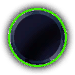
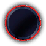

# MapModS Legend
<table>
<tr><th>Style: Normal</th><th>Style: Q Marks 1</th><th>Style: Q Marks 2</th><th>Style: Q Marks 3</th><th>Borders</th><th>Transition Mode Rooms</th></tr>
<tr valign=top><td>

|Pin|Pool|
|--|--|
||Dreamers|
||Skills|
||Charms|
||Keys|
||Mask Shards|
||Vessel Fragments|
||Charm Notches|
||Pale Ore|
||Geo Chests and Boss Geo|
||Rancid Eggs|
||Relics|
||Whispering Roots|
||Boss Essence|
||Grubs and Mimics|
||Maps|
||Stags|
||Lifeblood Cocoons|
||Grimmkin Flames|
||Journal Entries and Lore Tablets|
||Geo Rocks|
||Soul Totems|
||Shops|
||Levers|
  
</td><td>

|Pin|Pool|
|--|--|
||Shops|
||Everything else|
  
</td><td>

|Pin|Pool|
|--|--|
||Grubs and Mimics|
||Lifeblood Cocoons|
||Geo Rocks|
||Soul Totems|
||Shops|
||Everything else|
  
</td><td>
  
|Pin|Pool|
|--|--|
||Grubs and Mimics|
||Lifeblood Cocoons|
||Geo Rocks|
||Soul Totems|
||Shops|
||Everything else|
  
</td><td>
  
|Color|Meaning|
|--|--|
||Normal|
||Previewed|
||Persistent|
||Reachable by sequence break|
  
</td><td>

|Color|Meaning|
|--|--|
|Green|Current room|
|Cyan|Adjacent visited room|
|Red|Out-of-logic visited room|
|Yellow|Selected visited room|
|White|None of the above, visited room|

|Brightness|Meaning|
|--|--|
|Bright|Contains unchecked transitions|
|Dark|Fully explored| 
    
</td></tr> </table>
