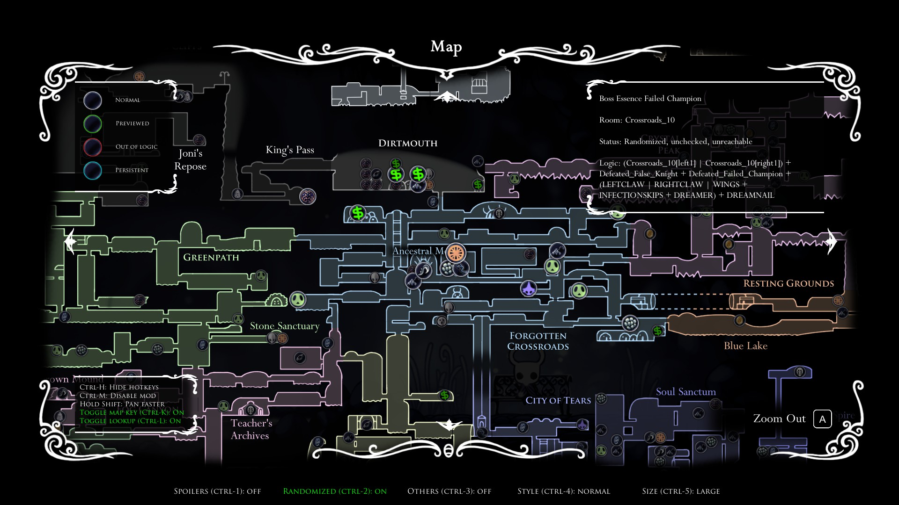
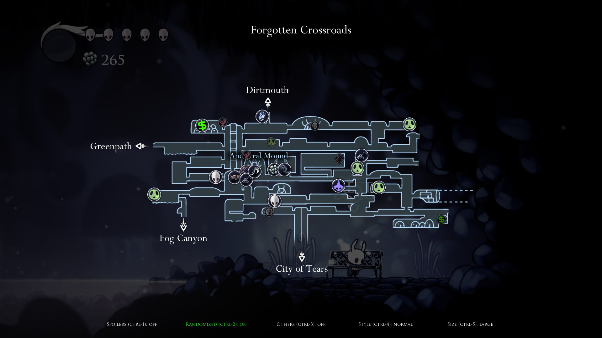
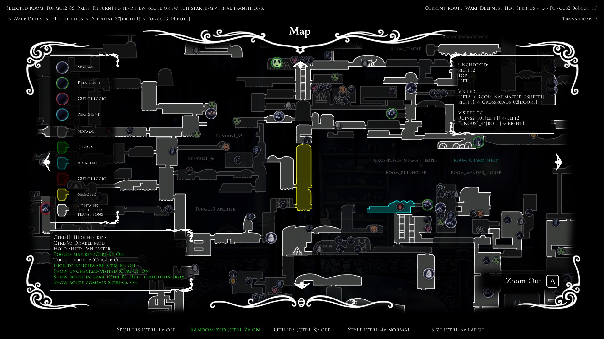
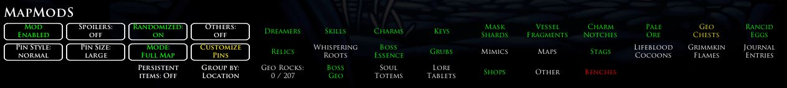

# Randomizer Map S

Randomizer Map S is a Hollow Knight mod used with Randomizer 4. It helps to find both item and transition checks.

This fork of CaptainDapper's original mod has been expanded on with many more features and bug fixes.

Dependencies:
- [RandomizerMod v4.0.3](https://github.com/homothetyhk/RandomizerMod) and all of its dependencies. Does NOT work with earlier versions
- [ConnectionMetadataInjector v1.1.8107.6258](https://github.com/BadMagic100/ConnectionMetadataInjector). Does NOT work with earlier versions
- [MagicUI v1.4.8178.42957](https://github.com/BadMagic100/HollowKnight.MagicUI). Does NOT work with earlier versions
- [Vasi](https://github.com/fifty-six/HollowKnight.Vasi)

Compatible optional mods:
- [AdditionalMaps](https://github.com/SFGrenade/AdditionalMaps). Highly recommended with this mod to view White Palace checks
- [RandomizableLevers](https://github.com/flibber-hk/HollowKnight.RandomizableLevers). Shows lever checks on map
- [RandoPlus](https://github.com/flibber-hk/HollowKnight.RandoPlus). Shows Mr Mushroom and nail upgrade checks on map
- Most other mods

This mod has support for languages other than English. You will need to source a `language.json` file and copy it to the `Randomizer 4` directory.

# Screenshots

Click to expand

    
    
    
    

# Quick Start Guide
- Press `CTRL-M` during a game to enable the mod. Alternatively, click the red button when the game is paused.
- [fireb0rn's quick MapModS guide (item randomizer)](https://www.youtube.com/watch?v=z35cFvU0McQ&t=1113s)
- [fireb0rn's quick MapModS guide (transition randomizer)](https://www.youtube.com/watch?v=z35cFvU0McQ&t=1195s)

# Features
## World Map / Quick Map
- Big pins: Items are reachable according to Randomizer logic.
- Small/grayed out pins: Items are not randomized or not reachable.
- Pins will disappear as you clear their locations. If item previews are enabled, it will show the corresponding previewed item.
- Pin settings are displayed at the bottom. See [Pause Menu](#pause-menu) for more info on the toggles.
- ``CTRL-H``: Expand/collapse the hotkey panel
- ``SHIFT``: Pan faster (same as right thumbstick on controller).
- ``CTRL-K``: Toggle a panel for the map key for the pin and room colors.
    - Check out the [Map Legend](./MAPLEGEND.md) for more details on each pin style.
- ``CTRL-L``: Toggle a panel for pin lookup on/off.
    - Hover over any visible pin to display info about the name, room, status, logic requirements, previewed items (if any) and spoiler items (if Spoilers on).
- ``CTRL-W``: Toggle benchwarp from the World Map on/off.
    - Hover over a room with a bench you have been to, and hold the indicated key/controller bind to do the benchwarp. Tap the same bind to switch benches located at the same map room.

## Pause Menu
- "Mod Enabled/Disabled" `CTRL-M`: Toggle the mod on/off
- "Spoilers" `CTRL-1`: Toggle pins between vanilla (non-spoiler) and spoiler item pools. For most gameplay, leave this setting off.
- "Randomized" `CTRL-2`: Toggle all pins for randomized items on/off
- "Others" `CTRL-3`: Toggle all pins for non-randomized items on/off
- "Pin Style" `CTRL-4`: Toggle the style of the pins
- "Pin Size" `CTRL-5`: Toggle the size of the pins
- "Mode": Toggle the map mode
    - "Transition": See more info below.
    - "Transition 2": Instead of showing all in-logic + visited rooms, only visited rooms appear. Depending on your Randomizer run, this might not change anything (and therefore may not be an option).
    - "Full Map": Shows all pins and the full map regardless of map items obtained
    - "All Pins": Shows all pins, but only show map areas for obtained map items
    - "Pins Over Map": Only show pins over where the corresponding map item has been obtained
- "Customize Pins":
    - Toggle each pool on/off.
    - "Persistent items": Toggle persistent items to always showing or not.
    - "Group by": Toggle the pools to be grouped by location, or by item (spoiler).

## Transition Mode
- Check out the in-game map key (`CTRL-K`) or the [Map Legend](./MAPLEGEND.md) for what the colors/brightness of each room indicate.
- Hover over a room and press the indicated key/controller bind to find a path.
- If successful, the path route will be displayed. You can try again to change the start/final transition to what you want.
- If the first step in the route is to benchwarp, hold the indicated key/controller bind to do the benchwarp.
- A compass arrow will point to the next transition you need to go to. The shown route gets updated after every transition.
- The Quick Map also shows the list of unchecked/visited/vanilla transitions for the current room.
- `CTRL-B`: Toggle including benchwarp in the pathfinder on/off.
- `CTRL-U`: Toggle a panel for unchecked/visited/vanilla transitions in the World Map on/off.
- `CTRL-R`: Toggle the route to be displayed in-game to full/next transition only/off.
- `CTRL-E`: Toggle behaviour when going off-route to keep route/cancel route/reevaluate route.
- `CTRL-C`: Toggle the route compass on/off.

## Customization
- To customize map and UI colors, download the [template file](https://github.com/syyePhenomenol/HollowKnight.MapModS/releases/download/v2.6.0/colors.json) and copy it to the same folder that contains the mod file ``MapModS.dll``. You only need to quit a save and re-enter one to reload the colors.
    - For Steam + Scarab users on Windows, the default folder is `...\Steam\steamapps\common\Hollow Knight\hollow_knight_Data\Managed\Mods\Randomizer Map S`.
    - Colors will be interpreted in standard RGBA format ``[r, g, b, a]``.
    - If you want to keep the default color of something, delete the corresponding line in the file (or change ``[r, g, b, a]`` to ``[]``).
- To customize pins, make a folder called 'Pins' containing your custom PNG files, and copy it to the same folder that contains the mod file 'MapModS.dll'. You only need to quit a save and re-enter one to reload the pins.
    - See the [default pins](./MapModS/Resources/Pins) for reference.
    - You only need to include the files you want to replace the original ones with.

# How To Install
Use Scarab: https://github.com/fifty-six/Scarab

Or, you can install manually:
1. Download the latest release of `MapModS.zip`.
2. Unzip and copy the folder 'MapModS' to `...\hollow_knight_Data\Managed\Mods`.

If you need any help, feel free to ask in any of the active Hollow Knight Discord servers.

# Acknowledgements
- Special thanks to Homothety and Flib for significant coding help
- CaptainDapper for making the original mod
- PimpasPimpinela for helping to port the mod from Rando 3 to Rando 4
- Chaktis, KingKiller39 and Ender Onryo for helping with sprite art
- ColetteMSLP for testing out the mod during livestreams
- BadMagic for CMICore/MagicUI and help with the UI migration
