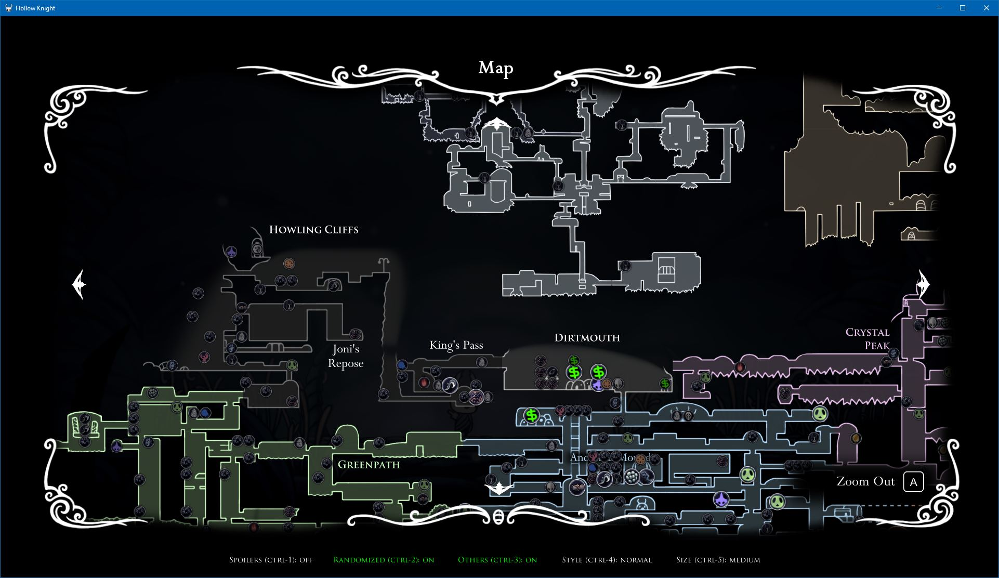
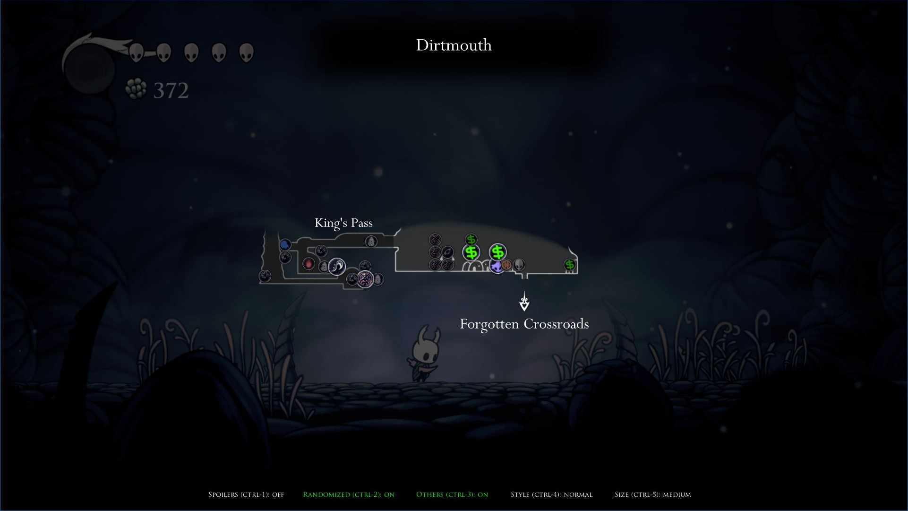
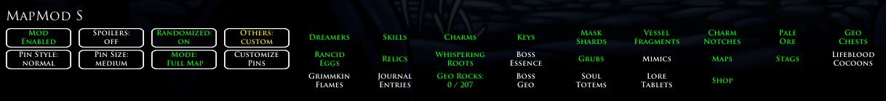

# MapMod S
MapMod S is a Hollow Knight mod used with Randomizer 4. It gives the option to show the player where items are on the World Map, and optionally what they are.

This fork of CaptainDapper's original mod has been expanded on with more features, bug fixes and a Pause Menu UI. It is currently compatible with:
- RandomizerMod v4.0.1
- AdditionalMaps v1.5.1.0
- ItemSync 2.0.0

https://github.com/homothetyhk/RandomizerMod

https://github.com/SFGrenade/AdditionalMaps

https://github.com/Shadudev/HollowKnight.MultiWorld/tree/itemsync

# Quick Start Guide
- Press `CTRL-M` during a game to enable the mod. Alternatively, enable it from the Pause Menu.

# Features
- The World Map will now show Pins for every item check.
    - Big Pins means the items are reachable according to RandomizerMod's logic
    - Small Pins means the items are not randomized or not reachable
    - Pins will disappear as you check their locations
    - MapMod S settings are displayed at the bottom

- The Pause Menu UI has the following buttons:
    - "Mod Enabled/Disabled": Toggle the mod on/off
    - "Spoilers" `CTRL-1`: Toggle Pins between vanilla (non-spoiler) and spoiler item pools
    - "Randomized" `Ctrl-2`: Toggle all Pins for randomized items on/off
    - "Others" `Ctrl-3`: Toggle all Pins for non-randomized items on/off
    - "Pin Style" `CTRL-4`: Toggle the style of the Pins
    - "Pin Size" `CTRL-5`: Toggle the style of the Pins
    - "Customize Pins": Open/close a panel with a toggle for each spoiler item pool

# How To Install
Use Scarab: https://github.com/fifty-six/Scarab

(if the latest version of MapMod S is a pre-release, it will not be on Scarab yet)

Or, you can install manually:
1. Download the latest release of `MapModS.zip`.
2. Unzip and copy the folder 'MapModS' to `...\Steam\steamapps\common\Hollow Knight\hollow_knight_Data\Managed\Mods`.

# Acknowledgements
- The Hollow Knight/Hollow Knight Speedrun Discord Channels for always giving very sound advice and suggestions
- CaptainDapper for making the original mod
- PimpasPimpinela for helping to port the mod from Rando 3 to Rando 4
- Chaktis for helping with sprite art

# Version Prelease 1 Changes
- AdditionalMaps compatibility
- CTRL-M is now a toggle, PlayerData is unaffected by the mod
- Improved UI features
- Non-randomized locations get cleared from the map (not including lore tablets and soul totems for now)
- Some other niceties carried over from VanillaMapMod

# Known Bugs / Missing Features
- Transition randomizer support
