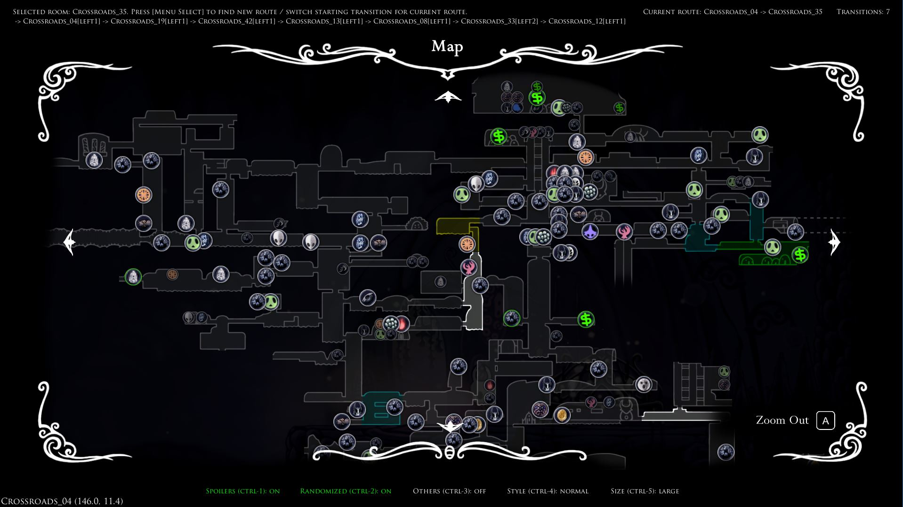

# Randomizer Map S
Randomizer Map S is a Hollow Knight mod used with Randomizer 4. It helps to find both item and transition checks.

This fork of CaptainDapper's original mod has been expanded on with many more features and bug fixes. It is currently compatible with:
- RandomizerMod v4.0.3
- AdditionalMaps v1.5.1.0. Highly recommended with this mod to view White Palace checks
- RandomizableLevers v1.1.2.1
- ItemSync v2.2.0
- RandoPlus v1.1.0
- SkillUpgrades v0.9.4.1

https://github.com/homothetyhk/RandomizerMod

https://github.com/SFGrenade/AdditionalMaps

https://github.com/flibber-hk/HollowKnight.RandomizableLevers

https://github.com/Shadudev/HollowKnight.MultiWorld/tree/itemsync

https://github.com/flibber-hk/HollowKnight.RandoPlus

https://github.com/flibber-hk/HollowKnight.SkillUpgrades

# Quick Start Guide
- Press `CTRL-M` during a game to enable the mod. Alternatively, enable it from the Pause Menu.

# Features
- The World Map will now show Pins for every item check.
    - Big Pins means the items are reachable according to RandomizerMod's logic
    - Small Pins means the items are not randomized or not reachable
    - Pins will disappear as you clear their locations
    - Pin settings are displayed at the bottom
    - Check out the [MapModS Legend](./MAPLEGEND.md) for more details on what each pin means, including the border colors.

- In the World Map, press ``CTRL-L`` to toggle a panel for Pin lookup on/off.
    - Hover over any visible Pin to display info about the name, pool, room and logic requirements.
    - This feature is disabled in "Transition" mode.

- The Pause Menu UI has the following buttons:
    - "Mod Enabled/Disabled": Toggle the mod on/off
    - "Spoilers" `CTRL-1`: Toggle Pins between vanilla (non-spoiler) and spoiler item pools
    - "Randomized" `Ctrl-2`: Toggle all Pins for randomized items on/off
    - "Others" `Ctrl-3`: Toggle all Pins for non-randomized items on/off
    - "Pin Style" `CTRL-4`: Toggle the style of the Pins
    - "Pin Size" `CTRL-5`: Toggle the size of the Pins
    - "Mode": Toggle the map mode
    - "Customize Pins": Open/close a panel with a toggle for each pool. You can control whether the pool toggles are grouped by location, or by item (spoiler).

- The mod currently has four main modes:
   - "Transition": For transition rando runs only
   - "Transition 2": For area rando runs only. Instead of showing all in-logic + visited rooms, only visited rooms appear
   - "Full Map": Shows all pins and the full map regardless of map items obtained
   - "All Pins": Shows all pins, but only show map areas for obtained map items
   - "Pins Over Map": Only show pins over where the corresponding map item has been obtained

- "Transition" mode displays visited rooms with color-coding, along with a pathfinder function.
    - Check out the [MapModS Legend](./MAPLEGEND.md) for more details on what the colors/brightness of each room indicate.
    - Hover over the selected room and press your bound `Menu Select` button to find a path. If successful, the path route will be displayed. You can try again to change the start/final transition to what you want.
    - The route will also be visible from the Quick Map, and in-game based on the below toggle. As you make the correct transitions, those transitions will get cleared from the route.
    - `CTRL-B`: Toggle including Benchwarp in the pathfinder on/off.
    - `CTRL-R`: Toggle the route to be displayed in-game full/next transition only/off.
    - `CTRL-U`: Toggle the panel for unchecked and visited transitions in the World Map. 

# How To Install
Use Scarab: https://github.com/fifty-six/Scarab

Or, you can install manually:
1. Download the latest release of `MapModS.zip`.
2. Unzip and copy the folder 'MapModS' to `...\Steam\steamapps\common\Hollow Knight\hollow_knight_Data\Managed\Mods`.

# Acknowledgements
- Special thanks to Homothety and Flib for significant coding help
- CaptainDapper for making the original mod
- PimpasPimpinela for helping to port the mod from Rando 3 to Rando 4
- Chaktis, KingKiller39 and Ender Onryo for helping with sprite art
- ColetteMSLP for testing out the mod during livestreams
